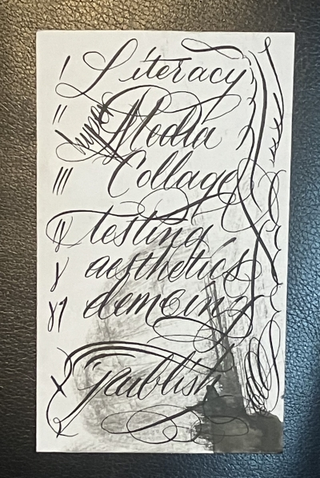

# syllabus

this _living_ syllabus is designed to be shared, and used by teachers and students. the goal is program is complete a 6 week cirriculum on writing with code and narrative. this workshop will explore computational notebooks as a tool for writing; with a focus on writing things you want to read.
